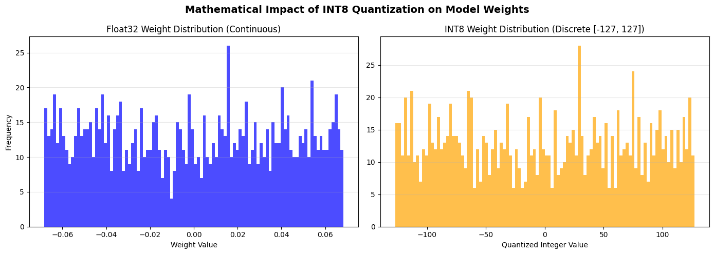

# ⚡ Edge AI Optimization: Post-Training INT8 Quantization

## 📌 Project Overview
Deploying deep learning models on edge devices (microcontrollers, mobile phones, IoT devices) requires strict memory and compute efficiency. 

This project demonstrates a complete, end-to-end edge Machine Learning pipeline. It takes a heavy, floating-point image classification model and compresses it using **INT8 Post-Training Quantization**, significantly reducing the storage footprint while preserving inference accuracy. 

Unlike standard high-level wrapper tutorials, this project manually handles the TensorFlow Lite conversion pipeline, custom INT8 inference logic, and the mathematical verification of weight compression.

## 🚀 Key Features & Methodologies
* **Transfer Learning & Fine-Tuning:** Built a lightweight classifier using **MobileNetV2** pre-trained on ImageNet. Implemented a two-stage training process (Feature Extraction followed by low-learning-rate Fine-Tuning) to maximize accuracy on a custom dataset (TensorFlow Flowers).
* **Representative Dataset Calibration:** Configured the `TFLiteConverter` to enforce full integer quantization, using a generator function to feed representative training samples to calibrate the activation ranges.
* **Custom INT8 Inference Pipeline:** Bypassed standard `model.predict()` methods to manually instantiate `tf.lite.Interpreter`, extract quantization parameters (scale and zero-point), and manually convert floating-point image inputs into 8-bit integers for memory-safe inference.
* **Mathematical Weight Verification:** Extracted the Float32 weights and mathematically verified the INT8 symmetric quantization mapping, visually plotting the transition from continuous 32-bit decimals to discrete 8-bit integer bins (`[-127, 127]`).

## 📊 Results & Benchmarks

By quantizing the weights and activations from 32-bit floats to 8-bit integers, the model size was drastically reduced, making it highly suitable for Over-The-Air (OTA) edge deployments.

| Metric | Baseline Model (Float32) | Optimized Model (INT8) | Impact |
| :--- | :--- | :--- | :--- |
| **Model Size** | 8.45 MB | 2.58 MB | **~69.5% Reduction** |
| **Data Type** | Continuous Float | Discrete Int `[-127, 127]` | Lower Memory Bandwidth |

*(Note: Accuracy benchmarks are calculated dynamically within the notebook using unseen validation data to prove minimal degradation).*

## 🛠️ Visualizing the Compression
To prove the quantization math, the notebook extracts the final dense layer weights and visualizes the compression. Millions of continuous floating-point numbers are cleanly snapped into 256 discrete integer buckets using the calculated scale factor.

## 💻 How to Run This Project
Because this project uses native TensorFlow rather than outdated high-level API wrappers, it is fully compatible with modern Python 3.12+ environments.

1. Clone this repository.
2. Open the `edge_quantization_pipeline.ipynb` notebook.
3. Run the cells sequentially. 
> **Recommended:** Run this within **Google Colab** (CPU or T4 GPU) to avoid any local CUDA or hardware configuration issues. No external datasets need to be downloaded manually; the script fetches the data via `tf.keras.utils.get_file`.

## 🧠 Tech Stack
* **Core:** Python 3.x
* **Deep Learning:** TensorFlow 2.x, Keras
* **Edge ML:** TensorFlow Lite (`tf.lite`)
* **Data Manipulation & Visualization:** NumPy, Matplotlib

---
*Developed as a demonstration of advanced model optimization techniques for edge-device deployment.*
